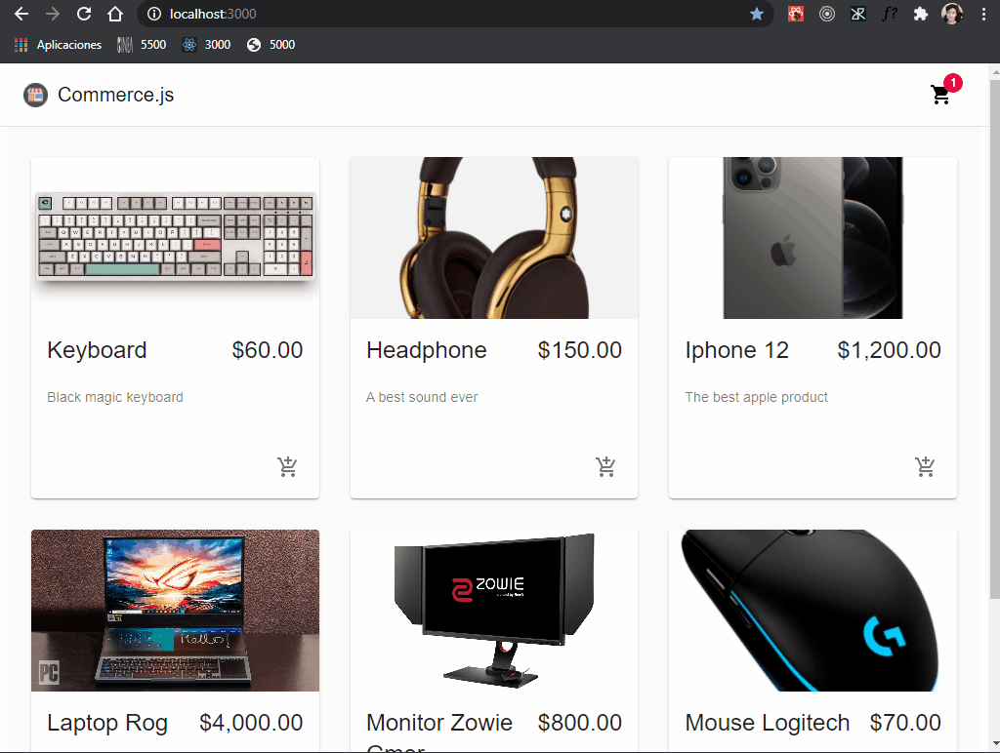

# E-commerce web en react

Aplicacion web desarrollada con React, MaterialUI, Commerce.js y Stripe.



Para instalar aplicacion ejecutar:

```
npm install
```

Para iniciar aplicacion ejecutar

```
npm start
```

------

Referencia de proyecto:

[JavaScript Mastery]([(7) JavaScript Mastery - YouTube](https://www.youtube.com/channel/UCmXmlB4-HJytD7wek0Uo97A))